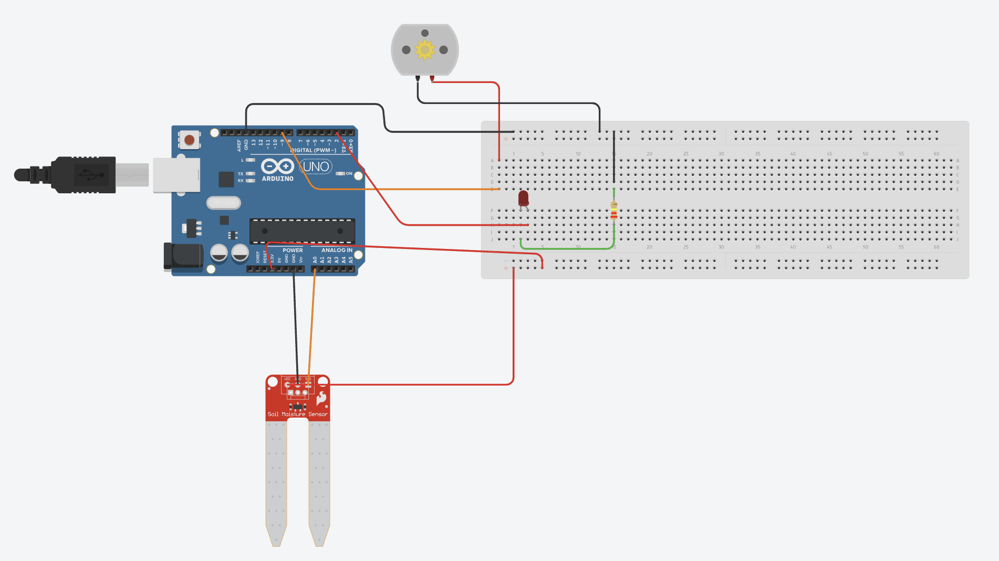
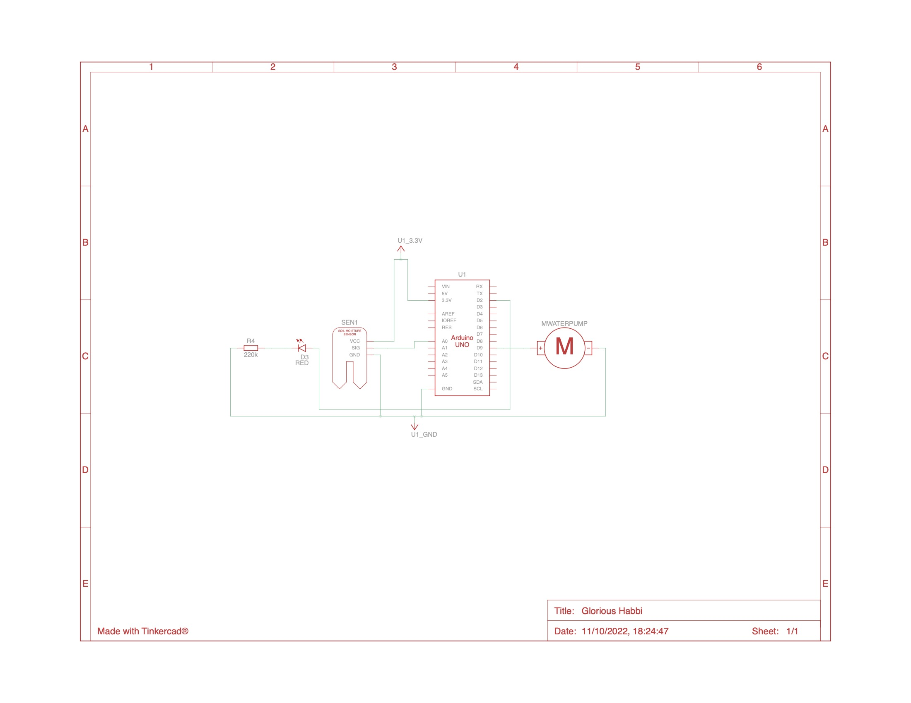

# elegooWaterSensor

This is a small Arduino project to read the water level of a container and turn the relevant LED base on the water level.

## Prerequisites

- Arduino IDE
- USB port / Adaptor for Mac M1
- Breadboard
- 1 resitor1 220 ohm / R4
- red LED / D3
- Arduino UNO R3 /  ELEgoo UNO R3 / U1
- Water Level Monitor (Analog sensor) / SEN1
- Water pump 5v / MWaterPump

## Circuit schematics and connections

## Current problems

### OPEN
- [] DEFECT 2: Unable to run with 3v Water pump. Need to confirm the Voltage out of the digital outputs from the Arduino UNO ->

### CLOSED
- [x] DEFECT 1: Current cicuite set up seems to be on opposity polarity and have to swap HIGHS for LOWS to reduce power consumtion, and LEDs be On instead of OFF. -> Fixed as previous connection had the ground and input back to front